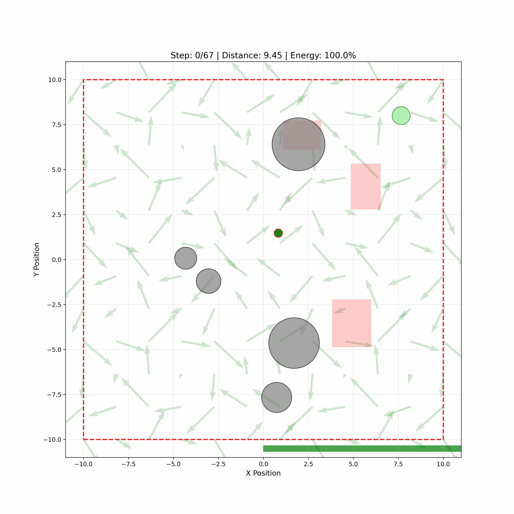

# Infinite Valley — Navigation Environment

A custom continuous-control reinforcement learning environment and agent.

**Project**: Infinite Valley Navigation (infinite_valley)

**Contents**
- `infinite_valley_env.py`: Environment implementation (terrain, dynamics, renderer).
- `agent.py`: Gymnasium adapter and SAC agent training script.
- `resources/`: assets (includes demo GIF).

**Environment (InfiniteValleyEnv)**
- World: Infinite 2D periodic terrain with hills and valleys.
- State: `[x, y, vx, vy]` — positions are unbounded; velocities clipped to ±5.
- Action: `[ax, ay]` thrust in [-1, 1].
- Dynamics: Gravity from terrain gradient, state-dependent friction, drag, and mild wind disturbances.
- Terrain: Multi-frequency periodic function with configurable `terrain_scale` and `terrain_amplitude`.
- Episode: `max_steps = 3000`, start at `[0,0]`, goal at `[60,60]` with radius `2.0`.

Key methods:
- `terrain_height(x, y)`: elevation at (x,y).
- `terrain_gradient(x, y)`: numerical gradient for gravity effect.
- `reset(start_pos=None)`: reset environment, returns initial state.
- `step(action)`: apply thrust, updates state, returns `(state, reward, done, info)`.
- `render()`: Matplotlib-based renderer; camera follows the agent.

**Agent & Training (Soft Actor-Critic)**
- `agent.py` provides:
  - `InfiniteValleyGymAdapter`: Gymnasium-compatible wrapper producing an 8-dimensional observation and shaping rewards.
  - `SoftActorCriticAgent`: helper to create the environment wrapped with `Monitor` and `TimeLimit`, and to train a `stable_baselines3.SAC` agent.
  - Callbacks: video saving (`SaveVideoEveryNEpisodesCallback`) and TensorBoard episode stats.

Observation (adapter): 8-dim vector: `[x_norm, y_norm, vx_norm, vy_norm, dx_goal, dy_goal, dist_goal, heading]`.

Reward shaping highlights:
- Dense progress reward (scaled progress toward the goal).
- Small per-step penalty to encourage speed.
- Large success bonus on reaching the goal.

**Dependencies**
- Python 3.8+
- numpy
- matplotlib
- gymnasium
- stable-baselines3
- torch
- (optional) ffmpeg for video saving

Install (recommended virtualenv):

```bash
python -m venv .venv
source .venv/bin/activate
pip install -r requirements.txt
# or install packages directly:
# pip install numpy matplotlib gymnasium stable-baselines3 torch
```

**Quick Start**
- Train the agent:

```bash
python agent.py
```

- Adjust training timesteps in `agent.py` (default `total_timesteps=300_000`).
- Render a single episode using the adapter:

```python
from agent import SoftActorCriticAgent
agent = SoftActorCriticAgent()
env = agent.env  # Monitor(TimeLimit(InfiniteValleyGymAdapter))
obs, _ = env.reset()
for _ in range(1000):
    action = env.action_space.sample()  # or use a trained model
    obs, reward, terminated, truncated, info = env.step(action)
    env.render()
    if terminated:
        break
```

**Resources**
- Demo GIF: `resources/agent.gif`



**Notes & Tips**
- The environment is intentionally challenging due to terrain and wind—tune friction, gravity, or reward shaping for faster learning.
- The renderer uses Matplotlib; performance is suitable for visualization but not real-time high-speed logging.
- The adapter writes `episode_steps.csv` to log episode outcomes.

**License & Attribution**
This project was created as an educational custom RL environment. Adjust and reuse as needed.

**Contributors**
- Arpitha
